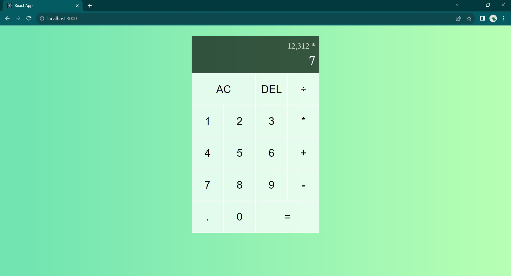

# React Calculator Project

Live base url --> https://vibhavk03.github.io/react-calculator/ 

- this is a simple calculator made using React 
- you can add, subtract, multiply and divide numbers 
- this calculator supports decimal numbers as well 
- it has an AC button which clears the display of the calculator 
- you can use the DEL button to delete any character that is mistyped 

## Tech Stack

- this project uses React library for building this calculator 
- styling is done using vanilla CSS 

## Solutioning

- DigitButton and OperationButton are two different components used to present digits and operation buttons in the calculator.
- useReducer hook is used for state management
- this calculator maintains 3 variables (currentOperand, previousOperand, operation) in the state to keep track of calculation
